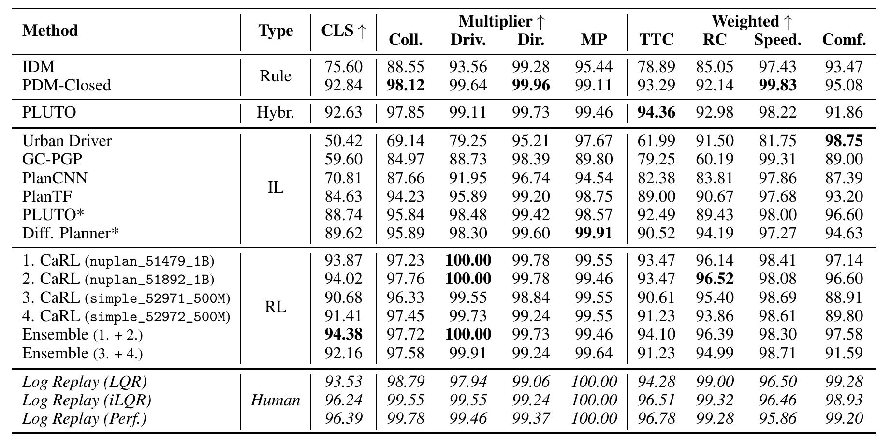

# 1. Results 🏆

## 1.1 Performance with non-reactive traffic on `Val14` 



## 1.2 Performance with reactive traffic on `Val14` 


<details>
<summary>Metrics</summary>
<br>
<ul>
    <li>Coll: No at-fault collision</li>
    <li>Driv.: Drivable Area Compliance</li>
    <li>Dir.: Driving Direction Compliance</li>
    <li>MP: Making progress</li>
    <li>TTC: Time to Collision (TTC) within bound</li>
    <li>RC: Route completion aka. Ego progress along the expert’s route ratio</li>
    <li>Speed.: Speed limit compliance</li>
    <li>Comf.: Comfort</li>
</ul>
For details visit the <a href="https://nuplan-devkit.readthedocs.io/en/latest/metrics_description.html">nuPlan documentation</a>. 
*denotes without post-processing. 
</details>

# 2. Install 📦

## 2.1 Dataset 🗃️
> [!IMPORTANT]  
> Before downloading any data, please ensure you have read the [nuPlan license](https://motional-nuplan.s3-ap-northeast-1.amazonaws.com/LICENSE).

In order to train and evaluate CaRL on nuPlan, you need to download the nuPlan dataset according to the [official documentation](https://nuplan-devkit.readthedocs.io/en/latest/dataset_setup.html). You can find a bash script for downloading nuPlan in [`/scripts/download/download_nuplan.sh`](https://github.com/autonomousvision/CaRL/blob/main/nuPlan/scripts/download/download_nuplan.sh) (~2TB). The data needs to be arranged in the following format:
```
nuplan
├── exp
└── dataset
    ├── maps
    │   ├── nuplan-maps-v1.0.json
    │   ├── sg-one-north
    │   │   └── ...
    │   ├── us-ma-boston
    │   │   └── ...
    │   ├── us-nv-las-vegas-strip
    │   │   └── ...
    │   └── us-pa-pittsburgh-hazelwood
    │       └── ...
    └── nuplan-v1.1
         ├── splits 
         │     ├── mini 
         │     │    ├── 2021.05.12.22.00.38_veh-35_01008_01518.db
         │     │    ├── ...
         │     │    └── 2021.10.11.08.31.07_veh-50_01750_01948.db
         │     ├── test 
         │     │    ├── 2021.05.25.12.30.39_veh-25_00005_00215.db
         │     │    ├── ...
         │     │    └── 2021.10.06.08.34.20_veh-53_01089_01868.db
         │     └── trainval
         │          ├── 2021.05.12.19.36.12_veh-35_00005_00204.db
         │          ├── ...
         │          └── 2021.10.22.18.45.52_veh-28_01175_01298.db
         └── sensor_blobs (empty)
```

Optionally, if you want to store the complete training dataset, you can download a pre-processed cache we used to train CaRL (see [`/scripts/download/download_cache.sh`](https://github.com/autonomousvision/CaRL/blob/main/nuPlan/scripts/download/download_cache.sh)). The maps are still required for training/evaluation. For evaluation on `Val14`, you only need to download the `val` logs. 

## 2.2 Code 📄

### 2.2.1 Download ⬇️
First, you need to download the [`nuplan-devkit`](https://github.com/motional/nuplan-devkit) and [`CaRL`](https://github.com/autonomousvision/CaRL) repository. For example, to install the repositories in the following structure 
```
~/carl_workspace
├── CaRL
└── nuplan-devkit
```
you can run:
```bash 
mkdir $HOME/carl_workspace
cd $HOME/carl_workspace
git clone git@github.com:autonomousvision/CaRL.git
git clone git@github.com:motional/nuplan-devkit.git
```

### 2.2.2 Environment Variables 🌍
Next, you need to set the following environment variables to your `~/.bashrc` (or before each bash script):
```bash
export NUPLAN_DATA_ROOT="/path/to/nuplan/dataset"
export NUPLAN_MAPS_ROOT="/path/to/nuplan/dataset/maps"

export NUPLAN_EXP_ROOT="$HOME/carl_workspace/exp"
export NUPLAN_DEVKIT_ROOT="$HOME/carl_workspace/nuplan-devkit"
export CARL_DEVKIT_ROOT="$HOME/carl_workspace/CaRL/nuPlan"
```

### 2.2.3 Conda environment 🐍
We use a conda environment to run the CaRL code. The installation consist of (1) creating a conda environment named `carl_nuplan` from the `environment.yml`, (2) installing the `nuplan-devkit` repository as editable pip package, and (3) installing the `CaRL` repository as editable pip package. Following the structure from above, you can run:
```bash
echo "1. Install conda environment"
source ~/.bashrc 
cd $CARL_DEVKIT_ROOT
conda env create --name carl_nuplan -f environment.yml

echo "2. Install nuplan-devkit code"
conda activate carl_nuplan
cd $NUPLAN_DEVKIT_ROOT
pip install -e .

echo "3. Install CaRL code"
cd $CARL_DEVKIT_ROOT
pip install -e .
```
> [!NOTE]  
> We use torch version `2.6.0` (instead the nuPlan default `1.9.0`). Moreover, we install `gymnasium` and further requirements on top of the nuPlan requirements (see `requirements_carl.txt`).

# 3. Training 🏋️

Before you can train a policy, we must first cache the scenarios used during training in a more lightweight format. Constantly querying information from the raw nuPlan logs is rather slow. Thus, we pre-process the nuPlan scenarios and store them as `gzip` files to access them during gym training. You can download our final cache with the script in [`/scripts/download/download_cache.sh`](https://github.com/autonomousvision/CaRL/blob/main/nuPlan/scripts/download/download_cache.sh). If you want to create your own cache (i.e. by changing the `scenario_filter`), you can run [`/scripts/gym/caching.sh`](https://github.com/autonomousvision/CaRL/blob/main/nuPlan/scripts/gym/caching.sh)

We provide training scripts in [`/scripts/gym/`](https://github.com/autonomousvision/CaRL/blob/main/nuPlan/scripts/gym).


# 4. Evaluation 🚗
We evaluate the trained policy with the `PPOPlanner` or `PPOEnsemblePlanner`. See `/scripts/simulation` for more information. All checkpoints are provided in the GitHub repository under `/checkpoints`. For example, our best policy can be evaluated with:
```bash
SPLIT=val14_split
CHECKPOINT="$CARL_DEVKIT_ROOT/checkpoints"
CHECKPOINT_NAME=nuplan_51892_1B

for CHALLENGE in closed_loop_nonreactive_agents_action closed_loop_reactive_agents_action; do
    python $NUPLAN_DEVKIT_ROOT/nuplan/planning/script/run_simulation.py \
    +simulation=$CHALLENGE \
    planner=ppo_planner \
    planner.ppo_planner.checkpoint_path="$CHECKPOINT/$CHECKPOINT_NAME/model_best.pth" \
    scenario_filter=$SPLIT \
    scenario_builder=nuplan \
    callback="[simulation_log_callback]" \
    main_callback="[time_callback, metric_file_callback, metric_aggregator_callback, metric_summary_callback, csv_main_callback]" \
    hydra.searchpath="[pkg://carl_nuplan.planning.script.config.common, pkg://carl_nuplan.planning.script.config.simulation, pkg://carl_nuplan.planning.script.experiments, pkg://nuplan.planning.script.config.common, pkg://nuplan.planning.script.experiments]" \
    group="$NUPLAN_EXP_ROOT/$CHECKPOINT_NAME"
done
```
Note that this scripts evaluated the reactive and non-reactive simulation of `Val14`. You can find the final results in the experiment folder stored in `"$NUPLAN_EXP_ROOT/$CHECKPOINT_NAME"`.

# 5. Visualization 🎨
You can visualize the simulations with the nuBoard from the [`nuplan-devkit`](https://github.com/motional/nuplan-devkit). For that, you can run:
```bash
conda activate carl_nuplan
python $NUPLAN_DEVKIT_ROOT/nuplan/planning/script/run_nuboard.py
```
Optionally, you can render the simulations with our script in `/notebooks/visualize.ipynb`. We added a bunch of `matplotlib` functions to visualize nuPlan datatypes in `/carl_nuplan/planning/simulation/visualization`. 


